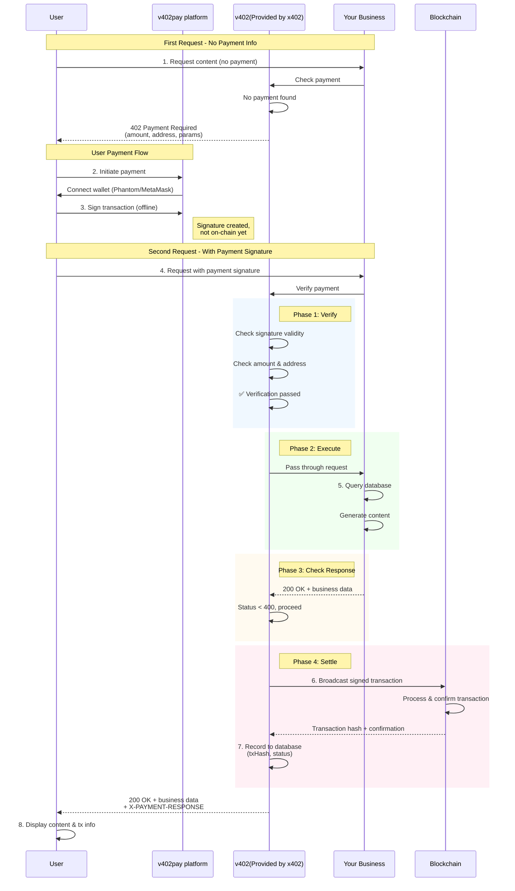
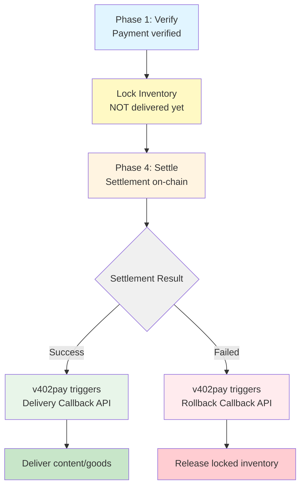

# @voyage_ai/v402-web-ts

Frontend browser SDK for quick integration with v402pay platform, supporting payment functionality on Solana (SVM) and Ethereum (EVM) chains.

## 📖 What is v402pay?

v402pay is a decentralized payment platform that helps developers quickly integrate Web3 payment features. After a successful payment, the platform automatically calls your configured callback interface to complete the delivery process.

### Payment Flow

v402pay uses a TCC-like two-phase commit pattern to ensure charges only occur after business logic succeeds:

```mermaid
flowchart LR
    Start[User requests content] --> Check{Has Payment<br/>Info?}
    Check -->|No| Return402["x402: Return 402<br/>Payment Required"]
    Return402 --> SDK[SDK initiates<br/>payment]
    SDK --> Wallet[User connects<br/>wallet]
    Wallet --> Sign[User signs<br/>offline]
    Sign --> Request2[Second request<br/>with signature]
    
    Check -->|Yes| Request2
    Request2 --> Verify["Phase 1: Verify<br/>Check payment"]
    Verify --> VerifyCheck{Valid?}
    VerifyCheck -->|Invalid| Return402
    VerifyCheck -->|Valid| Execute["Phase 2: Execute<br/>Pass to business"]
    
    Execute --> Business[Business logic<br/>Query & generate]
    Business --> Response["Phase 3: Check<br/>Validate status"]
    Response --> StatusCheck{Status OK?}
    
    StatusCheck -->|Failed| NoSettle[NO charge<br/>Return error]
    NoSettle --> End1[User sees error]
    
    StatusCheck -->|Success| Settle["Phase 4: Settle<br/>Broadcast tx"]
    Settle --> Chain[Blockchain<br/>confirmation]
    Chain --> Record[Record txHash]
    Record --> Display[User sees<br/>content & tx]
    
    style Start fill:#e3f2fd
    style Verify fill:#e1f5ff
    style Execute fill:#e8f5e9
    style Response fill:#fff4e1
    style Settle fill:#fce4ec
    style VerifyCheck fill:#f5f5f5
    style StatusCheck fill:#f5f5f5
    style NoSettle fill:#ffcdd2
    style Display fill:#c8e6c9
```



**Key Features:**

1. **Two-Phase Commit**: Verify payment first, execute business logic, then settle based on business result
2. **Business First**: No charge if business logic fails, avoiding charge-but-no-delivery scenarios
3. **Offline Signing**: User signs transaction offline; only broadcasts on-chain after business success
4. **Atomicity**: Either both business and payment succeed, or neither does

### Delivery Modes

#### Current: Immediate Delivery ⚡

The current implementation uses **immediate delivery** mode:

- **When it happens**: Business callback is triggered immediately after payment verification (Phase 2)
- **Settlement timing**: On-chain settlement happens after business logic completes
- **Best for**:
  - Digital content delivery (articles, videos, API access)
  - Services without inventory management
  - Use cases where settlement failure has minimal platform impact
- **Benefits**:
  - ✅ Fast user experience
  - ✅ Lower latency
  - ✅ User safety guaranteed (no charge if business fails)

**Trade-off**: If settlement fails after business execution, the platform bears minor risk as content was already delivered.

##### Sequence Diagram



**Key Points:**

1. **Two Requests**: First request returns 402, second request includes payment signature
2. **Offline Signing**: User signs in wallet without broadcasting to blockchain
3. **Verify → Execute → Check → Settle**: Four-phase process ensures safety
4. **Immediate Delivery**: Your business service executes and returns content immediately after verification
5. **Settlement After Business**: On-chain transaction only happens after business confirms success
6. **User Safety**: If business fails (status >= 400), no settlement occurs, no charge

#### Roadmap: Delayed Delivery 🔮

We're planning to offer **delayed delivery** mode as an optional feature:



- **When it happens**: Business callback is triggered only after on-chain settlement succeeds
- **Inventory locking**: Inventory is locked during verification, released on rollback
- **Best for**:
  - Physical goods delivery
  - Asset-based businesses (NFTs, tokens, securities)
  - High-value transactions requiring strong consistency
  - Scenarios where inventory management is critical
- **Benefits**:
  - ✅ Zero platform risk (no delivery before payment confirmation)
  - ✅ Strong consistency guarantees
  - ✅ Distributed transaction safety
  - ✅ Automatic rollback on failure

**How it works**:
1. **Verify Phase**: Lock resources/inventory, but don't deliver yet
2. **Settle Phase**: Attempt on-chain settlement
3. **On Success**: v402pay platform triggers your delivery callback API
4. **On Failure**: v402pay platform triggers your rollback callback API to release locks

This feature will be provided by the v402pay platform with configurable options for different merchant needs.

## 🚀 Quick Start

### 1. Register on v402pay Platform

Visit [v402pay Platform](https://v402pay.com) to create your merchant account:

1. Register an account
2. Create checkout configuration:
   - **Callback URL**: API endpoint called after successful payment
   - **Payment Price**: Fee per access (e.g., 0.01 USDC)
   - **Supported Networks**: Solana, Ethereum, Base, etc.
   - **Recipient Address**: Your receiving wallet address
3. Get your **checkoutId** (for frontend integration)

### 2. Install SDK

```bash
npm install @voyage_ai/v402-web-ts
```

### 3. Three Usage Methods

## Method 1: Use V402Checkout Component (Recommended, 1 Line of Code)

The easiest way - complete payment UI with wallet connection, payment processing, and result display built-in.

```tsx
import React from 'react';
import { V402Checkout } from '@voyage_ai/v402-web-ts/react';
import '@voyage_ai/v402-web-ts/react/styles.css';
import 'antd/dist/reset.css'; // Ant Design styles

export default function PaymentPage() {
  return (
    <V402Checkout
      checkoutId="your-checkout-id"  // Get from v402pay platform
      headerInfo={{
        title: 'Premium Content Access',
        subtitle: 'mysite.com',
        tooltipText: 'One-time payment for lifetime access'
      }}
      onPaymentComplete={(result) => {
        console.log('✅ Payment successful!', result);
        // Handle post-payment logic (redirect, show content, etc.)
      }}
      additionalParams={{
        userId: '123',
        // Any custom params to pass to your callback API
      }}
      expectedNetwork="evm" // Optional: 'evm' or 'svm'
      isModal={false}  // Optional: true for modal mode, false for full page
    />
  );
}
```

**Props:**
- `checkoutId` (required): Your checkout ID from v402pay platform
- `headerInfo` (optional): Customize header display
- `onPaymentComplete` (optional): Callback when payment succeeds
- `additionalParams` (optional): Custom parameters to pass to your callback API
- `expectedNetwork` (optional): Force specific network type ('evm' or 'svm')
- `isModal` (optional): Display as modal (true) or full page (false)

## Method 2: Use Built-in Hooks (Custom UI)

Perfect for building custom UI while leveraging built-in payment logic.

```tsx
import React from 'react';
import { 
  usePageNetwork,  // Auto-manage network for the page
  usePayment, 
  usePaymentInfo,
  WalletConnect 
} from '@voyage_ai/v402-web-ts/react';
import { makePayment, NetworkType } from '@voyage_ai/v402-web-ts';
import '@voyage_ai/v402-web-ts/react/styles.css';

export default function CustomPaymentPage() {
  const checkoutId = 'your-checkout-id';
  
  // Fetch payment info to get supported networks
  const { supportedNetworks, isLoading, paymentInfo } = usePaymentInfo(checkoutId);
  
  // Auto-manage wallet for this page's expected network
  const { address, networkType, disconnect } = usePageNetwork(
    supportedNetworks[0] || NetworkType.EVM,
    { autoSwitch: true }
  );
  
  const { isProcessing, setIsProcessing, result, setResult, error, setError } = usePayment();

  const handlePayment = async () => {
    if (!networkType) return;
    
    setIsProcessing(true);
    setError(null);
    
    try {
      const response = await makePayment(networkType, checkoutId);
      const data = await response.json();
      setResult(data);
      console.log('✅ Payment successful!', data);
    } catch (err: any) {
      setError(err.message || 'Payment failed');
    } finally {
      setIsProcessing(false);
    }
  };

  return (
    <div>
      <h1>Purchase Content</h1>
      
      {/* Wallet Connection */}
      {!isLoading && !address && (
        <WalletConnect supportedNetworks={supportedNetworks} />
      )}
      
      {/* Connected State */}
      {address && (
        <div>
          <p>Connected: {address}</p>
          <button onClick={disconnect}>Disconnect</button>
          <button onClick={handlePayment} disabled={isProcessing}>
            {isProcessing ? 'Processing...' : 'Pay Now'}
          </button>
        </div>
      )}
      
      {/* Result */}
      {result && (
        <div>
          <h2>Payment Successful! 🎉</h2>
          <pre>{JSON.stringify(result, null, 2)}</pre>
        </div>
      )}
      
      {error && <p style={{ color: 'red' }}>{error}</p>}
    </div>
  );
}
```

## Method 3: Direct Handler Integration (Advanced)

If you have your own wallet connection logic, directly call the payment handler functions.

```typescript
import { 
  handleSvmPayment,  // Solana payment
  handleEvmPayment,  // Ethereum payment
  NetworkType 
} from '@voyage_ai/v402-web-ts';

// Solana Payment Example
async function paySolana() {
  const checkoutId = 'your-checkout-id';
  const endpoint = 'https://v402.onvoyage.ai/api/pay';
  
  // Ensure user has connected Phantom wallet
  const wallet = window.solana;
  if (!wallet?.isConnected) {
    await wallet.connect();
  }
  
  // Call SVM payment handler
  const response = await handleSvmPayment(
    endpoint,
    {
      wallet,
      network: 'solana-mainnet',  // or 'solana-devnet'
      checkoutId,
      additionalParams: { userId: '123' }  // Optional
    }
  );
  
  const result = await response.json();
  console.log('Payment result:', result);
}

// Ethereum Payment Example
async function payEthereum() {
  const checkoutId = 'your-checkout-id';
  const endpoint = 'https://v402.onvoyage.ai/api/pay';
  
  // Get wallet adapter
  const walletAdapter = {
    address: await window.ethereum.request({ method: 'eth_requestAccounts' })[0],
    signTypedData: async (domain: any, types: any, message: any) => {
      // Implement EIP-712 signing
    },
    switchChain: async (chainId: string) => {
      // Implement chain switching
    }
  };
  
  // Call EVM payment handler
  const response = await handleEvmPayment(
    endpoint,
    {
      wallet: walletAdapter,
      network: 'base-mainnet',  // or 'ethereum-mainnet', 'polygon-mainnet', etc.
      checkoutId,
      additionalParams: { userId: '123' }  // Optional
    }
  );
  
  const result = await response.json();
  console.log('Payment result:', result);
}
```

## 📚 API Documentation

### React Hooks

#### `useWallet()`

Manage wallet connection state (external store, no Provider needed).

```typescript
const { 
  address,        // Wallet address (string | null)
  networkType,    // Network type (NetworkType | null)
  isConnecting,   // Is connecting (boolean)
  error,          // Error message (string | null)
  connect,        // Connect wallet: (networkType: NetworkType) => Promise<void>
  switchNetwork,  // Switch network: (networkType: NetworkType) => Promise<void>
  ensureNetwork,  // Ensure network: (networkType: NetworkType) => Promise<void>
  disconnect,     // Disconnect wallet: () => void
  clearError      // Clear error: () => void
} = useWallet();
```

**Features:**
- ✅ No Context Provider needed (uses React 18's `useSyncExternalStore`)
- ✅ Supports EVM and SVM wallet coexistence
- ✅ Auto-persists wallet addresses per network
- ✅ Prevents auto-reconnect after manual disconnect

#### `usePageNetwork(expectedNetwork, options?)`

Page-level network management - automatically ensures correct network for the page.

```typescript
const wallet = usePageNetwork(
  NetworkType.EVM,  // Expected network type for this page
  {
    autoSwitch: true,      // Auto-switch to expected network (default: true)
    switchOnMount: true,   // Switch on component mount (default: true)
  }
);
// Returns same interface as useWallet()
```

**Use Cases:**
- EVM-only pages: `usePageNetwork(NetworkType.EVM)`
- SVM-only pages: `usePageNetwork(NetworkType.SVM)`
- Automatic network management when switching between pages

**Example:**
```tsx
// Page A - EVM only
function EvmPage() {
  const { address } = usePageNetwork(NetworkType.EVM);
  return <div>EVM Address: {address}</div>;
}

// Page B - SVM only  
function SvmPage() {
  const { address } = usePageNetwork(NetworkType.SVM);
  return <div>SVM Address: {address}</div>;
}
```

#### `usePayment()`

Manage payment state (state only, no payment logic).

```typescript
const {
  isProcessing,    // Is processing (boolean)
  result,          // Payment result (any)
  error,           // Error message (string | null)
  setIsProcessing, // Set processing state
  setResult,       // Set result
  setError,        // Set error
  clearResult,     // Clear result
  clearError,      // Clear error
  reset            // Reset all states
} = usePayment();
```

#### `usePaymentInfo(checkoutId, endpoint?, additionalParams?)`

Fetch checkout payment configuration from backend.

```typescript
const {
  supportedNetworks,  // Supported network types (NetworkType[])
  isLoading,          // Is loading (boolean)
  error,              // Error message (string | null)
  paymentInfo         // Raw payment info from backend (any)
} = usePaymentInfo(
  'your-checkout-id',
  'https://v402.onvoyage.ai/api/pay',  // Optional
  { userId: '123' }                      // Optional
);
```

### React Components

#### `<V402Checkout />`

Complete checkout component with built-in wallet connection, payment UI, and result display.

```tsx
<V402Checkout
  checkoutId="your-checkout-id"           // Required
  headerInfo={{                            // Optional
    title: 'Payment Title',
    subtitle: 'yoursite.com',
    tooltipText: 'Payment description'
  }}
  isModal={false}                          // Optional: modal or full page
  onPaymentComplete={(result) => {}}       // Optional: callback
  additionalParams={{ userId: '123' }}    // Optional: custom params
  expectedNetwork={NetworkType.EVM}        // Optional: force network
/>
```

**Props:**
- `checkoutId` (required): Your checkout ID from v402pay
- `headerInfo` (optional): Customize header display
- `isModal` (optional): Display as modal (true) or full page (false)
- `onPaymentComplete` (optional): Callback function on successful payment
- `additionalParams` (optional): Custom parameters to pass to callback API
- `expectedNetwork` (optional): Force specific network type

#### `<WalletConnect />`

Standalone wallet connection component (used internally by V402Checkout).

```tsx
<WalletConnect
  supportedNetworks={[NetworkType.SOLANA, NetworkType.EVM]}
  className="custom-class"
  onConnect={(address, networkType) => {}}
  onDisconnect={() => {}}
/>
```

**Props:**
- `supportedNetworks`: Array of supported network types
- `className`: Custom CSS class name
- `onConnect`: Callback on successful connection
- `onDisconnect`: Callback on disconnect

### Core Functions

#### `makePayment(networkType, checkoutId, endpoint?, additionalParams?)`

Unified payment entry function that automatically handles different chain payment logic.

```typescript
import { makePayment, NetworkType } from '@voyage_ai/v402-web-ts';

const response = await makePayment(
  NetworkType.EVM,              // or NetworkType.SVM
  'your-checkout-id',
  'https://v402.onvoyage.ai/api/pay',  // Optional
  { userId: '123' }                     // Optional
);

const result = await response.json();
```

#### `handleSvmPayment(endpoint, options)`

Handle Solana (SVM) chain payments.

```typescript
import { handleSvmPayment } from '@voyage_ai/v402-web-ts';

const response = await handleSvmPayment(
  'https://v402.onvoyage.ai/api/pay',
  {
    wallet: window.solana,          // Phantom wallet
    network: 'solana-mainnet',      // or 'solana-devnet'
    checkoutId: 'your-checkout-id',
    additionalParams: { userId: '123' }  // Optional
  }
);
```

**Options:**
- `wallet`: Solana wallet adapter (Phantom, Solflare, etc.)
- `network`: Network name (e.g., 'solana-mainnet', 'solana-devnet')
- `checkoutId`: Your checkout ID
- `additionalParams`: Custom parameters for your callback API

#### `handleEvmPayment(endpoint, options)`

Handle Ethereum (EVM) chain payments.

```typescript
import { handleEvmPayment } from '@voyage_ai/v402-web-ts';

const response = await handleEvmPayment(
  'https://v402.onvoyage.ai/api/pay',
  {
    wallet: evmWalletAdapter,       // EVM wallet adapter
    network: 'base-mainnet',        // Network name
    checkoutId: 'your-checkout-id',
    additionalParams: { userId: '123' }  // Optional
  }
);
```

**Options:**
- `wallet`: EVM wallet adapter (must implement EvmWalletAdapter interface)
- `network`: Network name (e.g., 'ethereum-mainnet', 'base-mainnet', 'polygon-mainnet')
- `checkoutId`: Your checkout ID
- `additionalParams`: Custom parameters for your callback API

### Type Definitions

```typescript
// Network Type (用于区分钱包类型)
enum NetworkType {
  EVM = 'evm',      // Ethereum Virtual Machine
  SVM = 'svm',      // Solana Virtual Machine
  SOLANA = 'solana' // Alias for SVM
}

// Solana Wallet Adapter Interface
interface WalletAdapter {
  publicKey?: { toString(): string };
  address?: string;
  signTransaction: (tx: VersionedTransaction) => Promise<VersionedTransaction>;
}

// EVM Wallet Adapter Interface
interface EvmWalletAdapter {
  address: string;
  signTypedData: (domain: any, types: any, message: any) => Promise<string>;
  switchChain?: (chainId: string) => Promise<void>;
  getChainId?: () => Promise<string>;
}

// Payment Info from Backend
interface PaymentInfo {
  amount: string;
  currency: string;
  network: string;  // Network name (e.g., 'base-mainnet', 'solana-devnet')
  asset: string;
  maxAmountRequired: number;
}
```

## 🎨 Custom Styling

The SDK provides default styles that you can override:

```css
/* Override wallet connect button style */
.x402-wallet-button {
  background-color: your-color;
  border-radius: 8px;
}

/* Override wallet card style */
.x402-wallet-card {
  border: 2px solid your-color;
}
```

Or don't import default styles and fully customize:

```tsx
// Don't import default styles
// import '@voyage_ai/v402-web-ts/react/styles.css';

// Use your own components and styles
import { useWallet, usePayment } from '@voyage_ai/v402-web-ts/react';
import { makePayment } from '@voyage_ai/v402-web-ts';
```

## 🔧 Advanced Usage

### Multi-Network Support in One App

The SDK supports EVM and SVM wallets coexisting in the same application.

```tsx
import { usePageNetwork, NetworkType } from '@voyage_ai/v402-web-ts/react';

// Page 1: EVM Network
function EthereumPage() {
  const { address, networkType } = usePageNetwork(NetworkType.EVM);
  
  return (
    <div>
      <h2>Ethereum Payment Page</h2>
      <p>Connected: {address}</p>
      {/* EVM payment logic */}
    </div>
  );
}

// Page 2: SVM Network
function SolanaPage() {
  const { address, networkType } = usePageNetwork(NetworkType.SVM);
  
  return (
    <div>
      <h2>Solana Payment Page</h2>
      <p>Connected: {address}</p>
      {/* SVM payment logic */}
    </div>
  );
}
```

**Key Features:**
- ✅ Wallets cached separately per network
- ✅ Switching pages automatically switches wallet
- ✅ Disconnect on one network doesn't affect the other
- ✅ Refresh page maintains correct network context

### Monitor Wallet State Changes

```typescript
import { useWallet } from '@voyage_ai/v402-web-ts/react';
import { useEffect } from 'react';

function MyComponent() {
  const { address, networkType } = useWallet();
  
  useEffect(() => {
    if (address) {
      console.log('Wallet connected:', address, networkType);
      // Execute your logic
    }
  }, [address, networkType]);
}
```

### Handle Payment Response

The payment response includes both your callback API data and payment metadata:

```typescript
const handlePayment = async () => {
  try {
    const response = await makePayment(networkType, checkoutId);
    const data = await response.json();
    
    // data is your callback API response
    // For example:
    // {
    //   "success": true,
    //   "content": "Your purchased content",
    //   "downloadUrl": "https://...",
    //   "expiresAt": "2024-12-31"
    // }
    
    // Payment metadata in response headers
    const paymentResponse = response.headers.get('X-PAYMENT-RESPONSE');
    if (paymentResponse) {
      const paymentData = JSON.parse(paymentResponse);
      console.log('Transaction Hash:', paymentData.txHash);
    }
    
    if (data.success) {
      showContent(data.content);
    }
  } catch (error) {
    console.error('Payment failed:', error);
  }
};
```

### Error Handling

```typescript
import { useWallet, usePayment } from '@voyage_ai/v402-web-ts/react';
import { useEffect } from 'react';

function PaymentComponent() {
  const { error: walletError, clearError: clearWalletError } = useWallet();
  const { error: paymentError, clearError: clearPaymentError } = usePayment();
  
  useEffect(() => {
    if (walletError) {
      console.error('Wallet error:', walletError);
      // Handle wallet connection errors
    }
  }, [walletError]);
  
  useEffect(() => {
    if (paymentError) {
      console.error('Payment error:', paymentError);
      // Handle payment errors
      
      // Auto clear after 3 seconds
      setTimeout(() => {
        clearPaymentError();
      }, 3000);
    }
  }, [paymentError]);
}
```

**Common Error Scenarios:**
- Wallet not installed: `Please install MetaMask/Phantom wallet`
- User rejected: `User rejected the connection/transaction`
- Network mismatch: `Chain changed. Please reconnect your wallet.`
- Insufficient funds: Backend returns payment failure
- Invalid checkout: `Failed to load payment information`

## 🌐 Network Types vs Network Names

### Important Distinction

The SDK distinguishes between **Network Type** (wallet type) and **Network Name** (specific blockchain):

#### Network Type (钱包类型)
Used for wallet management - which wallet to connect:

```typescript
enum NetworkType {
  EVM = 'evm',      // Ethereum Virtual Machine wallets (MetaMask, etc.)
  SVM = 'svm',      // Solana Virtual Machine wallets (Phantom, etc.)
  SOLANA = 'solana' // Alias for SVM
}
```

**Usage:** `usePageNetwork(NetworkType.EVM)`, `connect(NetworkType.SVM)`

#### Network Name (具体网络)
Specific blockchain for the payment transaction:

**SVM Networks:**
- `solana-mainnet`
- `solana-devnet`

**EVM Networks:**
- `ethereum-mainnet`
- `base-mainnet`
- `polygon-mainnet`
- `avalanche-mainnet`
- `bsc-mainnet` (Binance Smart Chain)
- `arbitrum-mainnet`
- `optimism-mainnet`
- And other EVM-compatible chains

**Usage:** Used in `handleSvmPayment()`, `handleEvmPayment()`, and backend payment configuration

### Example

```typescript
// Network Type: EVM (which wallet to use)
const { address } = usePageNetwork(NetworkType.EVM);

// Network Name: base-mainnet (which blockchain to pay on)
const response = await handleEvmPayment(endpoint, {
  wallet: evmAdapter,
  network: 'base-mainnet',  // ← Network Name
  checkoutId: 'xxx'
});
```

## 📦 Dependencies

### Required Dependencies

```json
{
  "react": ">=18.0.0",
  "@solana/kit": "^3.0.0",
  "@solana-program/token": "^0.6.0",
  "@solana-program/token-2022": "^0.4.0",
  "@solana-program/compute-budget": "^0.8.0",
  "@solana-program/system": "^0.8.0",
  "antd": "^5.0.0" 
}
```

### Optional Dependencies

```json
{
  "ethers": "^6.0.0" 
}
```

**Note**: 
- If you only use `V402Checkout` component, all dependencies are included
- For custom integration, install only the wallets you need (Solana or EVM)
- Solana dependencies use the new `@solana/kit` unified SDK for better performance and smaller bundle size

## 🤝 Contributing

Issues and Pull Requests are welcome!

## 📄 License

MIT License

## 🔗 Links

- [v402pay Platform](https://v402pay.com)
- [GitHub Repository](https://github.com/voyage_ai/v402-web-ts)
- [npm Package](https://www.npmjs.com/package/@voyage_ai/v402-web-ts)

## 💡 Quick Examples

### Minimal Integration (1 Line)

```tsx
import { V402Checkout } from '@voyage_ai/v402-web-ts/react';
import '@voyage_ai/v402-web-ts/react/styles.css';

export default function App() {
  return <V402Checkout checkoutId="your-checkout-id" />;
}
```

### With Custom Callback

```tsx
import { V402Checkout } from '@voyage_ai/v402-web-ts/react';

export default function App() {
  return (
    <V402Checkout 
      checkoutId="your-checkout-id"
      onPaymentComplete={(result) => {
        // Redirect to success page
        window.location.href = `/content/${result.contentId}`;
      }}
    />
  );
}
```

### Modal Mode

```tsx
import { useState } from 'react';
import { V402Checkout } from '@voyage_ai/v402-web-ts/react';
import { Modal } from 'antd';

export default function App() {
  const [isModalOpen, setIsModalOpen] = useState(false);
  
  return (
    <>
      <button onClick={() => setIsModalOpen(true)}>
        Purchase Content
      </button>
      
      <Modal 
        open={isModalOpen} 
        onCancel={() => setIsModalOpen(false)}
        footer={null}
        width={520}
      >
        <V402Checkout 
          checkoutId="your-checkout-id"
          isModal={true}
          onPaymentComplete={(result) => {
            setIsModalOpen(false);
            // Handle success
          }}
        />
      </Modal>
    </>
  );
}
```

---

For questions, please visit [v402pay Documentation](https://docs.v402pay.com) or contact technical support.
